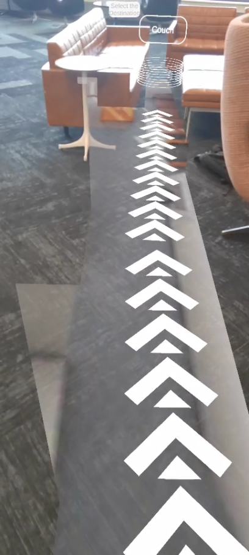
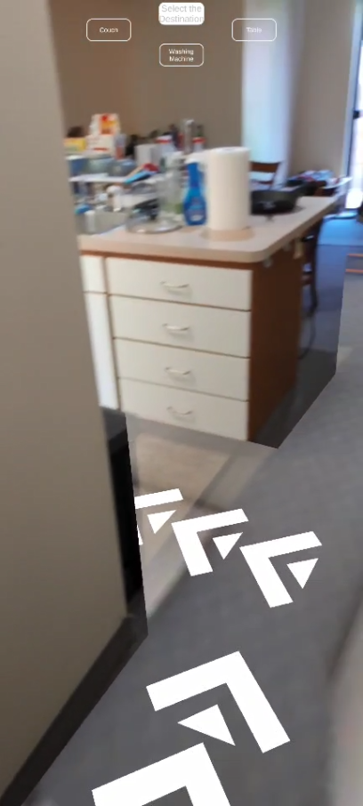

# ARpentHouse500
# Member Information
Last Name | First Name | CSU email address
-----------|------------|-----------
Zhongze     |Zhang     |zhongze@colostate.edu
Guirong     | Liang    |lgr9611@colostate.edu

# Introduction
Our AR indoor navigation project was developed based on Unity to instruct users on how to travel within the environment of a given building. We started with a simple scene modeling in this checkpoint instead of an entire building interior environment to test if the base code works properly. Once the modeling was complete, we added the target object (i.e., destination) to the environment. We then added a short script to unity, which was to set the navigation target and add two references to it, one for the top-down camera and the other for the navigation target object. Unfortunately, we had problems running the source code, and the two references did not show up even after debugging. We will continue to try to solve this problem by other methods.

# Methodology
To complete our AR indoor navigation project, three modules must be considered: mapping, positioning and rendering. Users can use their mobile devices to find and navigate on pre-recorded maps. The program will use scene understanding algorithms and 3D visual positioning algorithms to calculate the user's exact location in real-time. AR indoor navigation allows users to see digital attributes of physical spaces, such as virtual store signage, promotions, and other real-time information. The navigation route will appear interactively on the pre-recorded map of the mobile device to achieve virtual and real synchronization.

# Results
|    |
|    |
From the data collected, most participants needed around 20 seconds to reach their destination, and this time was highly correlated with the relocation time. It shows that the defect of the software is very obvious, and the defect directly affects the user's experience. We noticed that when the route deviates, the user needs to stand still to allow the AR navigation to relocate, and the longer the relocation time, the longer the user spends in total. Users who were disappointed with the use of this AR navigation and gave negative ratings in the questionnaire experienced prolonged relocations or route deviations during their use.
        
# Related Experiment
We will design an experiment to test the practicality of our AR indoor navigation application. The experimenters will be divided into two parts. In the case of ensuring that they are not familiar with our preset maps, part of the experimenters can only reach the designated place through the signs in the building, and the other part can use AR indoor navigation to find a destination. We will compare the time taken by the two groups to reach the destination to analyze whether AR indoor navigation is practical, in other words, whether the user can get to the goal faster.

# Conclusion
Although we encountered some difficulties along the way, we still completed the main content after changing some of the development methods. In the whole process, we think the most interesting and important thing is that the auxiliary function of AR technology is very powerful, AR technology can make users get the information that users need more directly\cite{4637573}. This can be proved in our project or other AR technology projects. We believe that AR technology still has great potential. AR technology will be widely used in various industries and even people's lives in the future. AR technology has great potential.

# Development environment and tool
Unity, Meshroom, Google form

# Youtube Videos
1 https://youtube.com/shorts/2J18BpeSVfM?feature=share 

2 https://youtube.com/shorts/7_Vu3O9Z414?feature=share

# Github
https://github.com/csu-hci-projects/ARpentHouse500.git
